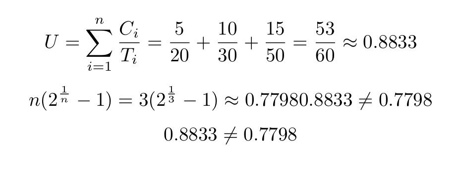
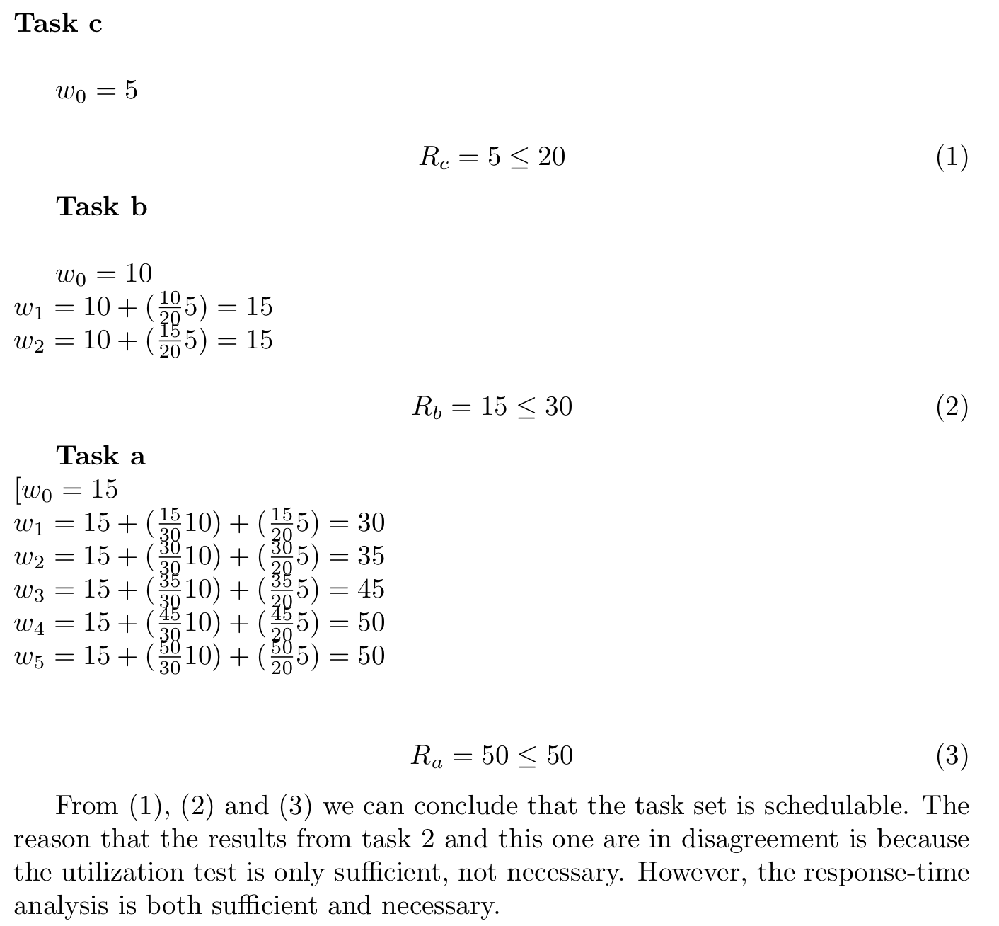

# Exercise 9 - Scheduling

## README EDITED WITH OUR ANSWERS

### Task 1:
 1. Why do we assign priorities to tasks?
    ##### - To tell the scheduler what task that should be finished first/should be given process time.
 2. What features must a scheduler have for it to be usable for real-time systems?
    ##### - The scheduler needs to be predictable

## Inversion and inheritance

| Task | Priority   | Execution sequence | Release time |
|------|------------|--------------------|--------------|
| a    | 3          | `E Q V E`          | 4            |
| b    | 2          | `E V V E E E`      | 2            |
| c    | 1 (lowest) | `E Q Q Q E`        | 0            |

 - `E` : Executing
 - `Q` : Executing with resource Q locked
 - `V` : Executing with resource V locked

### Task 2: Draw Gantt charts to show how the former task set:
#### 1. Without priority inheritance

 | Task | 0 | 1 | 2 | 3 | 4 | 5 | 6 | 7 | 8 | 9 | 10 | 11 | 12 | 13 | 14 |
 |------|---|---|---|---|---|---|---|---|---|---|----|----|----|----|----|
 | a    |   |   |   |   | E |   |   |   |   |   |    | Q  | V  | E  |    |
 | b    |   |   | E | V |   | V | E | E | E |   |    |    |    |    |    |
 | c    | E | Q |   |   |   |   |   |   |   | Q | Q  |    |    |    | E  |

####  2. With priority inheritance

| Task | 0 | 1 | 2 | 3 | 4 | 5 | 6 | 7 | 8 | 9 | 10 | 11 | 12 | 13 | 14 |
|------|---|---|---|---|---|---|---|---|---|---|----|----|----|----|----|
| a    |   |   |   |   | E |   |   | Q |   | V | E  |    |    |    |    |
| b    |   |   | E | V |   |   |   |   | V |   |    | E  | E  | E  |    |
| c    | E | Q |   |   |   | Q | Q |   |   |   |    |    |    |    | E  |

### Task 3: Explain:
 1. What is priority inversion? What is unbounded priority inversion?
    ##### - If both a high- and a low-priority task share the same resource it can happen that the high-priority
    task has to wait for the low-priority task to finish. This is called priority inversion.
    Unbounded priority inversion is when we first have a priority inversion in the first place,
    and then another task prevents the low-priority task to release its resource so the high-priority task
    ends up waiting forever.

 3. Does priority inheritance avoid deadlocks?
    ##### - No it does not prevent deadlocks.

## Utilization and response time

### Task set 2:

| Task | Period (T) | Exec. Time (C) |
|------|------------|----------------|
| a    | 50         | 15             |
| b    | 30         | 10             |
| c    | 20         | 5              |

### Task 4:
 1. There are a number of assumptions/conditions that must be true for the utilization and response time tests to be usable (The "simple task model"). What are these assumptions? Comment on how realistic they are.
 ##### The simple task model
       Assumptions:
       - Tasks that are periodic, and with known times.
       - A fixed set of tasks
       - No overhead
       - Independent tasks
      Most of these fairly realistic, but some require some workaround.
 2. Perform the utilization test for the task set. Is the task set schedulable?

 ##### For the task set to be schedulable \( U \leq n(2^{\frac{1}{n}} - 1) \) needs to be true.
##### Utilization test:

##### The test fails, so we do not know if the task set is schedulable.

 3. Perform response-time analysis for the task set. Is the task set schedulable? If you got different results than in 2), explain why.

 

## Formulas

Utilization:  

Response-time:  

